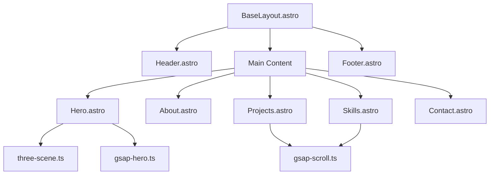

# Design Document

## Overview

現在のNext.jsポートフォリオサイトをAstroで完全に書き直し、クリエイティブ・アーティスティックなデザインを実現する。GSAP + Three.js によるインタラクティブな体験と、Astroのアイランドアーキテクチャによる高パフォーマンスを両立する。

## Steering Document Alignment

### Technical Standards (tech.md)
- Astro 5.x を使用（最新の安定版）
- TypeScript strict モード
- Tailwind CSS v4（`<style>`タグ不使用、ユーティリティクラスのみ）
- ESLint + Prettier によるコード品質管理

### Project Structure (structure.md)
- Astro 標準のプロジェクト構造に従う
- コンポーネントは機能別にディレクトリ分け
- スクリプトは `src/scripts/` に集約

## Code Reuse Analysis

### Existing Components to Leverage
- **翻訳データ**: `locales/en.json`, `locales/ja.json` の内容を移行（日本語はブラッシュアップ）
- **プロジェクトデータ**: 現在のプロジェクト情報を Content Collections に移行
- **スキルデータ**: Developer/Designer スキルデータを統合
- **画像アセット**: `public/` 内の画像をそのまま利用

### Integration Points
- **AWS S3 + CloudFront**: 既存のデプロイインフラを継続利用
- **Google Fonts**: Inter, Space Grotesk フォントを継続使用

## Architecture

Astroのアイランドアーキテクチャを採用し、インタラクティブな部分のみにJavaScriptを使用。



### Modular Design Principles
- **Single File Responsibility**: 各Astroコンポーネントは1つのセクションまたは機能を担当
- **Component Isolation**: UIコンポーネントは再利用可能な形で分離
- **Service Layer Separation**: データ取得は `src/data/` に、スクリプトは `src/scripts/` に分離
- **Utility Modularity**: i18n、テーマ管理などはユーティリティとして分離

## Project Structure

```
src/
├── components/
│   ├── common/
│   │   ├── Header.astro
│   │   ├── Footer.astro
│   │   ├── ThemeToggle.astro
│   │   └── LanguageToggle.astro
│   ├── sections/
│   │   ├── Hero.astro
│   │   ├── About.astro
│   │   ├── Projects.astro
│   │   ├── Skills.astro
│   │   └── Contact.astro
│   └── ui/
│       ├── Button.astro
│       ├── Card.astro
│       ├── Badge.astro
│       └── ProjectCard.astro
├── layouts/
│   └── BaseLayout.astro
├── pages/
│   ├── index.astro
│   ├── ja/
│   │   ├── index.astro
│   │   └── projects/
│   │       └── [slug].astro
│   └── projects/
│       └── [slug].astro
├── i18n/
│   ├── utils.ts
│   ├── en.json
│   └── ja.json
├── scripts/
│   ├── gsap/
│   │   ├── init.ts
│   │   ├── hero-animations.ts
│   │   └── scroll-animations.ts
│   └── three/
│       └── hero-scene.ts
├── styles/
│   └── global.css
├── content/
│   └── projects/
│       ├── en/
│       │   ├── project-1.md
│       │   └── project-2.md
│       └── ja/
│           ├── project-1.md
│           └── project-2.md
└── data/
    ├── skills.ts
    └── social-links.ts
```

## Components and Interfaces

### BaseLayout.astro
- **Purpose:** 全ページ共通のレイアウト、メタタグ、View Transitions設定
- **Interfaces:** `Props { title: string; description: string; locale: string }`
- **Dependencies:** astro:transitions, global.css
- **Reuses:** なし（ベースレイアウト）

### Hero.astro
- **Purpose:** フルスクリーンのヒーローセクション、3D要素とアニメーション
- **Interfaces:** `Props { locale: string }`
- **Dependencies:** Three.js, GSAP, i18n
- **Reuses:** i18n/utils.ts

### Projects.astro
- **Purpose:** プロジェクト一覧の表示（開発・デザイン統合）
- **Interfaces:** `Props { locale: string }`
- **Dependencies:** Content Collections, GSAP ScrollTrigger
- **Reuses:** ui/ProjectCard.astro, gsap/scroll-animations.ts

### ThemeToggle.astro
- **Purpose:** ライト/ダークテーマの切り替え
- **Interfaces:** なし（スタンドアロン）
- **Dependencies:** なし
- **Reuses:** なし

### LanguageToggle.astro
- **Purpose:** 言語切り替えUI
- **Interfaces:** `Props { currentLocale: string }`
- **Dependencies:** astro:i18n
- **Reuses:** i18n/utils.ts

## Data Models

### Project (Content Collection)
```typescript
interface Project {
  title: string;
  description: string;
  category: 'development' | 'design';
  tags: string[];
  image: string;
  link?: string;
  github?: string;
  featured: boolean;
  // Case Study
  overview?: {
    problem: string;
    solution: string;
    results: string[];
  };
  techStack?: string[];
}
```

### Skill
```typescript
interface Skill {
  name: string;
  category: 'frontend' | 'backend' | 'design' | 'tools';
  icon: string;
  level: 'beginner' | 'intermediate' | 'advanced' | 'expert';
}
```

### SocialLink
```typescript
interface SocialLink {
  name: string;
  url: string;
  icon: string;
}
```

## Styling Strategy

### Tailwind CSS Configuration
```typescript
// tailwind.config.mjs
export default {
  content: ['./src/**/*.{astro,html,js,jsx,md,mdx,svelte,ts,tsx,vue}'],
  darkMode: 'class',
  theme: {
    extend: {
      colors: {
        primary: 'var(--color-primary)',
        secondary: 'var(--color-secondary)',
        accent: 'var(--color-accent)',
        background: 'var(--color-background)',
        foreground: 'var(--color-foreground)',
        muted: 'var(--color-muted)',
        card: 'var(--color-card)',
        border: 'var(--color-border)',
      },
      fontFamily: {
        display: ['Space Grotesk', 'sans-serif'],
        body: ['Inter', 'sans-serif'],
        mono: ['JetBrains Mono', 'monospace'],
      },
    },
  },
  plugins: [],
};
```

### CSS Variables (global.css)
```css
@import 'tailwindcss';

:root {
  --color-primary: #6366f1;
  --color-secondary: #ec4899;
  --color-accent: #14b8a6;
  --color-background: #fafafa;
  --color-foreground: #0a0a0a;
  --color-muted: #737373;
  --color-card: #ffffff;
  --color-border: #e5e5e5;
}

.dark {
  --color-background: #0a0a0a;
  --color-foreground: #fafafa;
  --color-muted: #a3a3a3;
  --color-card: #171717;
  --color-border: #262626;
}
```

## Animation Strategy

### GSAP Initialization
```typescript
// scripts/gsap/init.ts
import { gsap } from 'gsap';
import { ScrollTrigger } from 'gsap/ScrollTrigger';

gsap.registerPlugin(ScrollTrigger);

// Reduced motion check
const prefersReducedMotion =
  window.matchMedia('(prefers-reduced-motion: reduce)').matches;

export { gsap, ScrollTrigger, prefersReducedMotion };
```

### Hero Animation
```typescript
// scripts/gsap/hero-animations.ts
import { gsap, prefersReducedMotion } from './init';

export function animateHero() {
  if (prefersReducedMotion) {
    gsap.set('.hero-text, .hero-subtitle', { opacity: 1 });
    return;
  }

  const tl = gsap.timeline();
  tl.from('.hero-text', {
    y: 100,
    opacity: 0,
    duration: 1,
    ease: 'power4.out',
  })
  .from('.hero-subtitle', {
    y: 50,
    opacity: 0,
    duration: 0.8,
    ease: 'power3.out',
  }, '-=0.5');
}
```

### Three.js Scene
```typescript
// scripts/three/hero-scene.ts
import * as THREE from 'three';

export function initHeroScene(canvas: HTMLCanvasElement) {
  const scene = new THREE.Scene();
  const camera = new THREE.PerspectiveCamera(75, window.innerWidth / window.innerHeight, 0.1, 1000);
  const renderer = new THREE.WebGLRenderer({ canvas, alpha: true, antialias: true });

  // TorusKnot geometry with wireframe
  const geometry = new THREE.TorusKnotGeometry(1, 0.3, 100, 16);
  const material = new THREE.MeshStandardMaterial({
    color: 0x6366f1,
    metalness: 0.7,
    roughness: 0.2,
    wireframe: true,
  });
  const mesh = new THREE.Mesh(geometry, material);
  scene.add(mesh);

  // Lighting
  const ambientLight = new THREE.AmbientLight(0xffffff, 0.5);
  const pointLight = new THREE.PointLight(0xec4899, 1);
  pointLight.position.set(5, 5, 5);
  scene.add(ambientLight, pointLight);

  camera.position.z = 5;

  // Mouse tracking
  let mouseX = 0, mouseY = 0;
  const onMouseMove = (e: MouseEvent) => {
    mouseX = (e.clientX / window.innerWidth) * 2 - 1;
    mouseY = -(e.clientY / window.innerHeight) * 2 + 1;
  };
  document.addEventListener('mousemove', onMouseMove);

  // Animation loop
  const animate = () => {
    requestAnimationFrame(animate);
    mesh.rotation.x += 0.005;
    mesh.rotation.y += 0.005;
    mesh.position.x = mouseX * 0.5;
    mesh.position.y = mouseY * 0.5;
    renderer.render(scene, camera);
  };
  animate();

  // Cleanup function
  return () => {
    document.removeEventListener('mousemove', onMouseMove);
    renderer.dispose();
  };
}
```

## i18n Strategy

### Configuration (astro.config.mjs)
```javascript
export default defineConfig({
  site: 'https://mun-k.com',
  output: 'static',
  i18n: {
    defaultLocale: 'en',
    locales: ['en', 'ja'],
    routing: {
      prefixDefaultLocale: false,
    },
  },
});
```

### Translation Helper
```typescript
// i18n/utils.ts
import en from './en.json';
import ja from './ja.json';

const translations = { en, ja } as const;
type Locale = keyof typeof translations;

export function useTranslation(locale: Locale) {
  const t = (key: string): string => {
    const keys = key.split('.');
    let value: unknown = translations[locale];

    for (const k of keys) {
      if (typeof value === 'object' && value !== null) {
        value = (value as Record<string, unknown>)[k];
      }
    }

    return typeof value === 'string' ? value : key;
  };

  return { t };
}

export function getLocaleFromUrl(url: URL): Locale {
  const [, locale] = url.pathname.split('/');
  return locale === 'ja' ? 'ja' : 'en';
}
```

## Error Handling

### Error Scenarios
1. **Three.js initialization failure**
   - **Handling:** Catch error, show static fallback image
   - **User Impact:** 3D animation not shown, but content accessible

2. **Content Collection load failure**
   - **Handling:** Return empty array, log error
   - **User Impact:** Projects section shows "No projects available"

3. **Translation key not found**
   - **Handling:** Return key as fallback
   - **User Impact:** Shows untranslated key (for debugging)

## Testing Strategy

### Unit Testing
- i18n utility functions
- Data transformation functions
- GSAP animation configurations (mock DOM)

### Integration Testing
- Page rendering with different locales
- Theme switching persistence
- Navigation between pages

### End-to-End Testing (Playwright)

Playwrightを使用したE2Eテストを実装。

#### Configuration
```typescript
// playwright.config.ts
import { defineConfig, devices } from '@playwright/test';

export default defineConfig({
  testDir: './tests/e2e',
  fullyParallel: true,
  forbidOnly: !!process.env.CI,
  retries: process.env.CI ? 2 : 0,
  workers: process.env.CI ? 1 : undefined,
  reporter: 'html',
  use: {
    baseURL: 'http://localhost:4321',
    trace: 'on-first-retry',
  },
  projects: [
    { name: 'chromium', use: { ...devices['Desktop Chrome'] } },
    { name: 'firefox', use: { ...devices['Desktop Firefox'] } },
    { name: 'webkit', use: { ...devices['Desktop Safari'] } },
    { name: 'mobile', use: { ...devices['iPhone 13'] } },
  ],
  webServer: {
    command: 'npm run dev',
    url: 'http://localhost:4321',
    reuseExistingServer: !process.env.CI,
  },
});
```

#### Test Structure
```
tests/
└── e2e/
    ├── home.spec.ts        # ホームページ全セクション表示テスト
    ├── navigation.spec.ts  # ナビゲーション、ページ遷移テスト
    ├── i18n.spec.ts        # 言語切り替えテスト
    ├── theme.spec.ts       # テーマ切り替え、永続化テスト
    └── a11y.spec.ts        # アクセシビリティテスト
```

#### Test Scenarios
1. **home.spec.ts**
   - 全セクション（Hero, About, Projects, Skills, Contact）の表示確認
   - スクロールアニメーションのトリガー確認
   - 3Dシーンの読み込み確認

2. **navigation.spec.ts**
   - ヘッダーナビゲーションリンクの動作
   - プロジェクト詳細ページへの遷移
   - 戻るボタンの動作
   - View Transitionsの確認

3. **i18n.spec.ts**
   - 言語切り替えUIの動作
   - URLの変更（/ja/ プレフィックス）
   - コンテンツの言語変更確認

4. **theme.spec.ts**
   - テーマトグルボタンの動作
   - localStorage への永続化
   - システム設定の反映

#### npm Scripts
```json
{
  "scripts": {
    "test:e2e": "playwright test",
    "test:e2e:ui": "playwright test --ui",
    "test:e2e:headed": "playwright test --headed"
  }
}
```

## Build Configuration

```javascript
// astro.config.mjs
import { defineConfig } from 'astro/config';
import tailwindcss from '@tailwindcss/vite';

export default defineConfig({
  site: 'https://mun-k.com',
  output: 'static',
  build: {
    assets: '_assets',
  },
  i18n: {
    defaultLocale: 'en',
    locales: ['en', 'ja'],
    routing: {
      prefixDefaultLocale: false,
    },
  },
  vite: {
    plugins: [tailwindcss()],
  },
});
```
